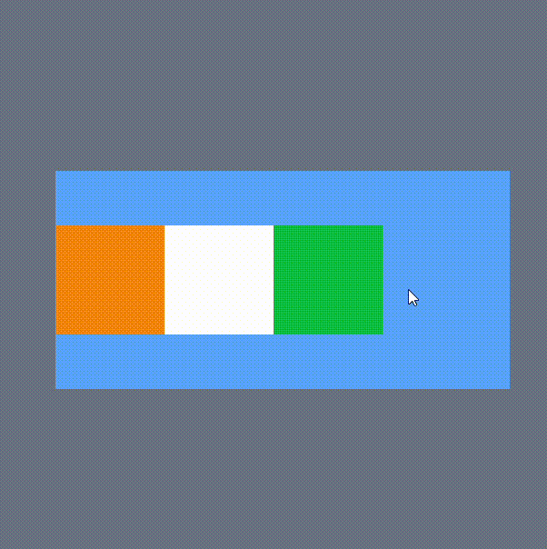

# 🤸 Tailwind CSS Flexbox Utilities (with Visuals)

Master Flexbox in Tailwind with quick visual references.

---

## 🔹 `flex` vs `inline-flex`

| Class         | Visual |
|---------------|--------|
| `flex`        |  |
| `inline-flex` |  |

---

## 🔄 Flex Direction

| Class              | Visual |
|--------------------|--------|
| `flex-row`         |  |
| `flex-col`         |  |

---

## 🧱 Flex Wrap

| Class           | Visual |
|-----------------|--------|
| `flex-wrap`     |  |
| `flex-nowrap`   |  |

---

## 📍 Justify Content

| Class              | Visual |
|--------------------|--------|
| `justify-start`    |  |
| `justify-center`   |  |
| `justify-end`      |  |
| `justify-between`  |  |
| `justify-around`   |  |
| `justify-evenly`   |  |

---

## 📐 Align Items

| Class             | Visual |
|-------------------|--------|
| `items-start`     |  |
| `items-center`    |  |
| `items-end`       |  |
| `items-stretch`   |  |
| `items-baseline`  |  |

---

## 📏 Flex Grow / Shrink / Basis

| Class        | Visual |
|--------------|--------|
| `flex-1`     |  |
| `flex-auto`  |  |
| `flex-none`  |  |

---

## 🔃 Order

| Class     | Visual |
|-----------|--------|
| `order-*` |  |

---

✅ Now you can visualize what each class does, directly in your README.  
Let me know if you'd like a **Grid**, **Spacing**, or **Column layout** visual section too!

🔙 [Back to Home](../README.md)

